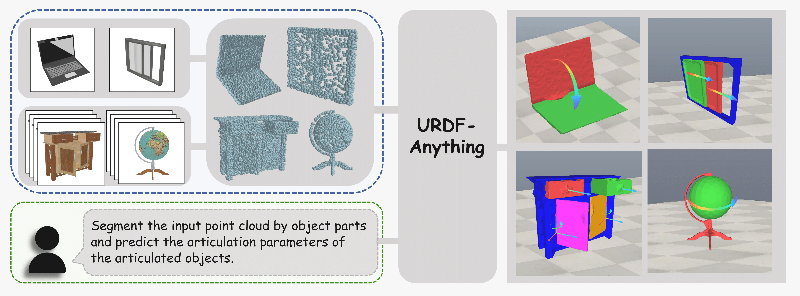

<br>
<p align="center">
<h1 align="center"><strong>URDF-Anything: Constructing Articulated Objects with 3D Multimodal Language Model
</strong></h1>
  <p align="center">
      <strong><span style="color: red;">NIPS 2025 Spotlight</span></strong>
    <br>
   Zhe Li*</a>&emsp;
   Xiang bai*</a>&emsp;
      Jieyu Zhang</a>&emsp;
   Zhuangzhe Wu</a>&emsp;
    Che Xu</a>&emsp;
      Ying Li</a>&emsp;
      Chengkai Hou</a>&emsp;
      Shanghang Zhang</a>&emsp;
    <br>
    Peking University &emsp; University of Washington
    <br>
    *Indicates Equal Contribution
    <br>
  </p>
</p>

  

<p align="center">
  <a href="https://lzvsdy.github.io/URDF-Anything/"><b>📖 Project Page</b></a> |
  <a href="https://arxiv.org/abs/2511.00940"><b>📄 Paper Link</b></a> |
</p>


We introduce **URDF-Anything**, an end-to-end automatic reconstruction framework based on a 3D Multimodal Large Language Model (MLLM). It allows for the generation of functional URDF digital twins from visual observations (single or multi-view images) by jointly inferring: 
* Geometric Part Segmentation; 
* Kinematic Structure (Joint type, axis, origin, etc.); 
* Physics-ready URDF files via a specialized [SEG] token mechanism.


<div align="center">
    
</div>

## Roadmap / Schedule

* [✅ ] 🧹 **Repo polish & consistency**

  - Finalize module/file organization (e.g., `seg_decoder/decoder.py`, `PointCrossAttentionDecoder`)
  - Ensure the repo runs out-of-the-box

* [ ] 🗂️ **Dataset preprocessing**

  - Provide PartNet-Mobility preprocessing scripts and documentation
  - Provide URDF dataset preparation scripts

* [ ] 🚀 **Inference**

  - Release inference scripts with CLI/config examples

* [ ] 📦 **Weights / checkpoints**

  - Publish pretrained weights/checkpoints


## Installation
1. Create the Conda environment:
  ```bash
  conda env create -f environment.yaml
  ```
2. Install the pointnet2_ops dependency:
  ```bash
  pip install "git+https://github.com/erikwijmans/Pointnet2_PyTorch.git#egg=pointnet2_ops&subdirectory=pointnet2_ops_lib"
  ```

## Pretrained Weights
Please download the following pretrained model weights and place them in the specified directories:
- Download the general-purpose checkpoint from [ShapeLLM](https://github.com/qizekun/ShapeLLM/blob/main/docs/MODEL_ZOO.md) and save it to: ./checkpoints/ShapeLLM_7B_general_v1.0
- Download Uni3D checkpoint from [Uni3D](https://github.com/baaivision/Uni3D) and save it to: ./checkpoints/Uni3D
- Download Recon checkpoint from [ShapeLLM](https://github.com/qizekun/ShapeLLM/blob/main/docs/MODEL_ZOO.md) and save it to: ./checkpoints/recon


## Training
Start the training process with:
```bash
bash ./run_train.sh
```

## Citation
```bibtex
@misc{li2025urdfanythingconstructingarticulatedobjects,
      title={URDF-Anything: Constructing Articulated Objects with 3D Multimodal Language Model}, 
      author={Zhe Li and Xiang Bai and Jieyu Zhang and Zhuangzhe Wu and Che Xu and Ying Li and Chengkai Hou and Shanghang Zhang},
      year={2025},
      eprint={2511.00940},
      archivePrefix={arXiv},
      primaryClass={cs.RO},
      url={https://arxiv.org/abs/2511.00940}, 
}
```

## 📄 License
This project is released under the [MIT License](LICENSE).

## 🙏 Acknowledgement
This codebase is built upon [ShapeLLM](https://github.com/qizekun/ShapeLLM), [Uni3D](https://github.com/baaivision/Uni3D) and [LISA](https://github.com/dvlab-research/LISA.git). We thank the authors for their open-source contributions.